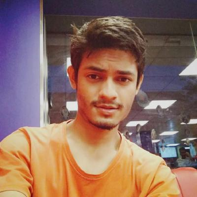

+++
title = "Reetwik Das"
description = "Ph.D. Student @ IIT Madras"
date = "2024-10-24"
toc = false
+++

I am currently working in the area of hardware security of AI/ML models under the supervision on Dr. [Chester Rebeiro](https://www.cse.iitm.ac.in/~chester/) in I2SSL Lab in IIT Madras. We look at some attacks possible on pre-trained ML models after being deployed on an embedded device and also provide suitable countermeasures against them. 

## Research Interests

* Security of AI/ML
* Hardware security
* Side channels analysis 

### [Blogs](https://reetwikdasblogs.azurewebsites.net/)

